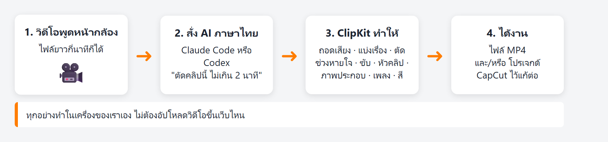
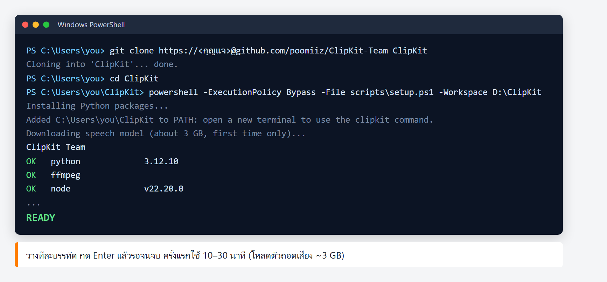
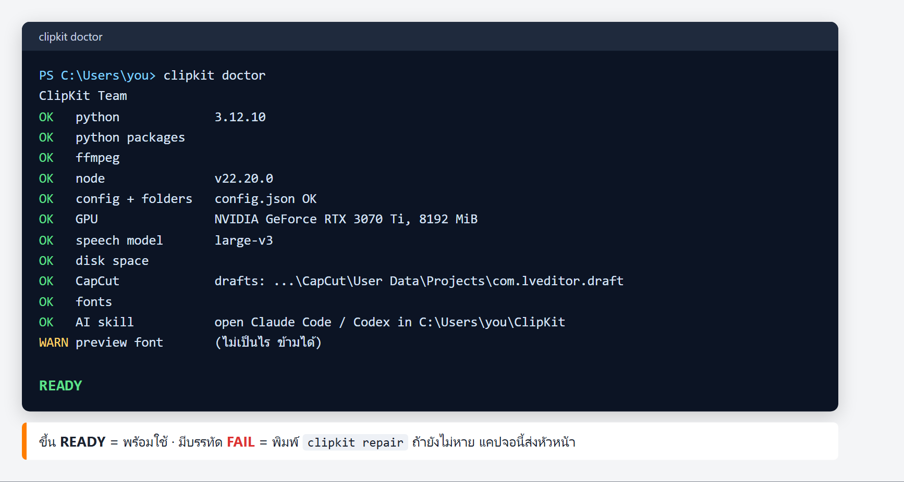
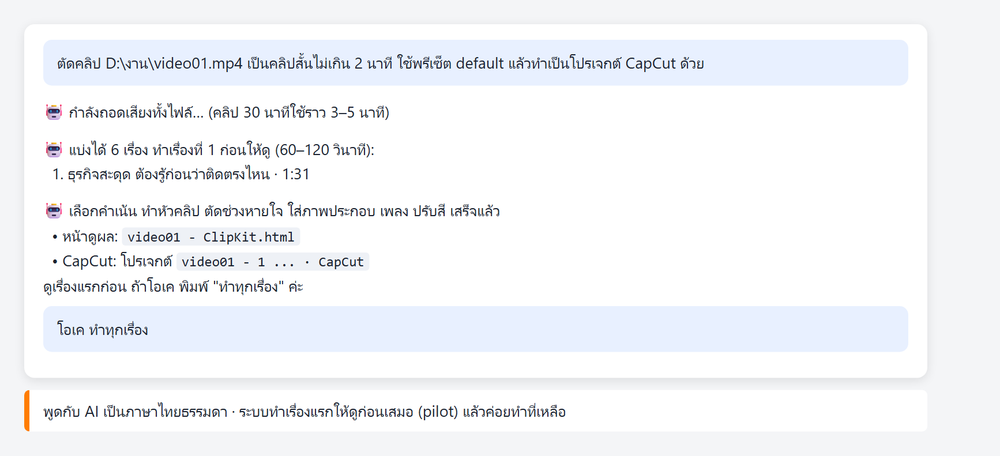
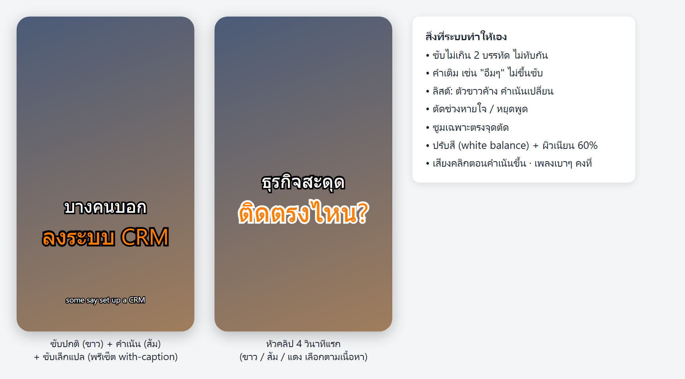
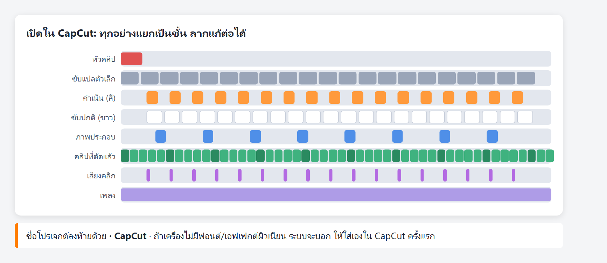
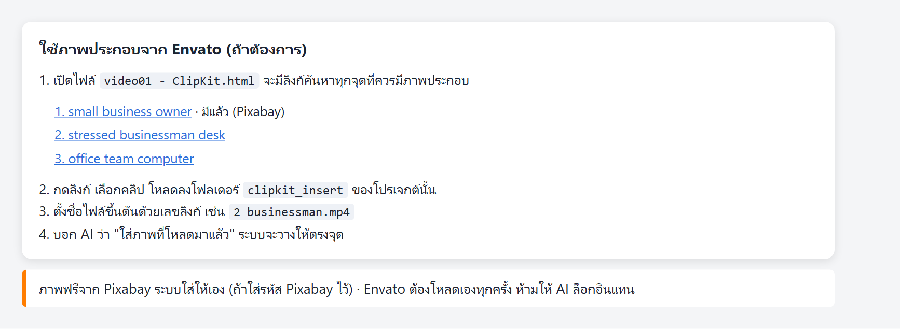

# คู่มือ ClipKit Team

ClipKit ตัดวิดีโอพูดหน้ากล้องให้เป็นคลิปสั้นแนวตั้งอัตโนมัติ เราแค่สั่ง AI เป็นภาษาไทย



---

## 1. ก่อนเริ่ม (ต้องมี)

- คอม **Windows** (Mac ยังไม่รองรับ) แนะนำการ์ดจอ NVIDIA จะถอดเสียงเร็วกว่ามาก
- พื้นที่ว่างอย่างน้อย 10 GB
- **git**: ลงจาก [git-scm.com](https://git-scm.com/download/win) กด Next ไปจนจบ
- **Claude Code** หรือ **Codex** (AI ที่สั่งงาน) ของตัวเอง
- **CapCut สำหรับ PC** ถ้าจะทำเป็นโปรเจกต์ CapCut (เปิดโปรแกรม 1 ครั้งก่อนติดตั้ง ClipKit)

## 2. ติดตั้ง (ทำครั้งเดียว)

เปิด **PowerShell** (กดปุ่ม Windows พิมพ์ `PowerShell` แล้ว Enter) แล้ววางทีละบรรทัด:

```
git clone https://github.com/poomiiz/ClipKit-Team ClipKit
cd ClipKit
powershell -ExecutionPolicy Bypass -File scripts\setup.ps1 -Workspace D:\ClipKit
```

`D:\ClipKit` คือโฟลเดอร์เก็บงาน เปลี่ยนเป็นที่อื่นได้ ระบบจะลงโปรแกรมที่ขาดให้เอง (Python, ffmpeg, Node.js, ตัวถอดเสียง ~3 GB)
ครั้งแรกใช้ราว 10–30 นาที ถ้าหน้าต่างถามสิทธิ์ ให้กด Yes



**บรรทัดสุดท้ายต้องขึ้นว่า `READY`** ถ้าไม่ขึ้น ดูข้อ 6

## 3. เช็กเครื่อง

เปิด PowerShell หน้าต่างใหม่ แล้วพิมพ์ `clipkit doctor`



- `OK` = ผ่าน · `WARN` บรรทัด preview font = ไม่เป็นไร
- `FAIL` = มีของขาด พิมพ์ `clipkit repair` แล้วลองใหม่

## 4. ทำคลิป

1. เปิด Claude Code หรือ Codex **ในโฟลเดอร์ ClipKit** (เช่น `C:\Users\<ชื่อคุณ>\ClipKit`)
2. พิมพ์สั่งเป็นภาษาไทยธรรมดา เช่น
   - `ตัดคลิป D:\งาน\video01.mp4 เป็นคลิปสั้นไม่เกิน 2 นาที ทำเป็นโปรเจกต์ CapCut ด้วย`
   - `ตัดคลิปนี้ ขอไฟล์ MP4`
   - `ใช้พรีเซ็ต with-caption` (มีซับแปลอังกฤษเล็กๆ ด้านล่าง)
3. ระบบทำ **เรื่องแรกให้ดูก่อน** ดูแล้วโอเคค่อยบอก `ทำทุกเรื่อง`



ผลที่ได้:
- **หน้าดูผล** `ชื่อวิดีโอ - ClipKit.html` อยู่ข้างไฟล์วิดีโอ เปิดด้วย Chrome
- **MP4** อยู่ใน `D:\ClipKit\output\exports` (คลิป 1 นาที ใช้ราว 3–4 นาที)
- **โปรเจกต์ CapCut** ชื่อลงท้าย `· CapCut` เปิดใน CapCut แก้ต่อได้





### ภาพประกอบจาก Envato (ถ้าต้องการ)



### พรีเซ็ตซับของตัวเอง

บอก AI ได้เลย เช่น `สร้างพรีเซ็ตชื่อ my-look ตัวปกติขาวขอบดำ ตัวเน้นเหลืองใหญ่กว่า`
หรือดึงจากโปรเจกต์ CapCut ที่เคยตัดเอง: `สร้างพรีเซ็ตจากโปรเจกต์ CapCut ชื่อ ...`

### ทำผ่านหน้าต่าง ClipKit (ไม่ต้องพิมพ์)

ดับเบิลคลิกไอคอน **ClipKit Nina** บนเดสก์ท็อป (ไอคอนขึ้นเองหลังสั่งตัดคลิปครั้งแรก หรือพิมพ์ `clipkit app`)
เลือกไฟล์วิดีโอ ระบบแบ่งเรื่อง ตัดช่วงเงียบ ทำซับ แล้วแก้หัวคลิปหรือตัดประโยคที่ไม่เอาได้ในหน้าต่าง
กดปุ่ม CapCut เพื่อสร้างโปรเจกต์ไปเกลาต่อ · ฉบับนี้ยังไม่มีภาพประกอบ เพลง และเสียงเอฟเฟกต์
มีรุ่นใหม่: กดปุ่ม **⬆️ อัปเดต ClipKit** มุมบน

## 5. อัปเดตเป็นรุ่นใหม่

ไม่ต้องทำอะไร ทุกครั้งที่สั่งตัดคลิป ระบบเช็กและอัปเดตตัวเองก่อนเริ่มงาน (ต้องต่อเน็ต)
ผลตรวจคลิปแต่ละคลิป (ตัวเลขและปัญหาที่เจอ ไม่มีคำพูดในคลิป) ส่งขึ้นชีตของทีมเอง
อยากอัปเดตทันทีโดยไม่ตัดคลิป: พิมพ์ `clipkit update`

## 6. มีปัญหา

| อาการ | ทำแบบนี้ |
|---|---|
| ติดตั้งแล้วไม่ขึ้น READY | พิมพ์ `clipkit repair` |
| พิมพ์ `clipkit` แล้วไม่รู้จัก | ปิด PowerShell แล้วเปิดใหม่ (ครั้งแรกหลังติดตั้ง) |
| `git` ไม่รู้จัก | ลง git จาก git-scm.com แล้วเปิด PowerShell ใหม่ |
| โปรเจกต์ CapCut ไม่ขึ้นใน CapCut | ปิด CapCut แล้วเปิดใหม่ |
| AI บอกว่าขาดฟอนต์ / เอฟเฟกต์ผิวเนียน | ใส่เองใน CapCut ครั้งแรก ครั้งต่อไปจะมีให้ |
| อย่างอื่น | พิมพ์ `clipkit doctor` แคปจอส่งหัวหน้า |
